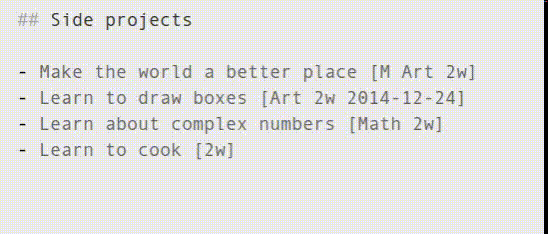
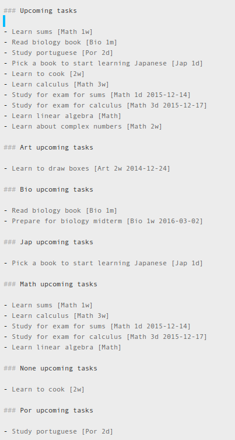
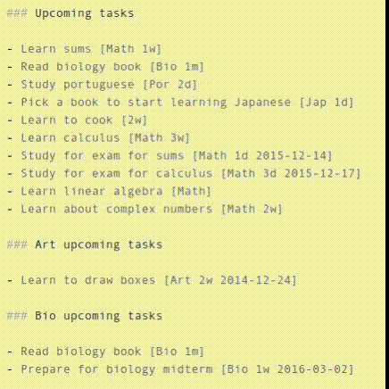
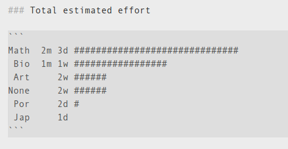
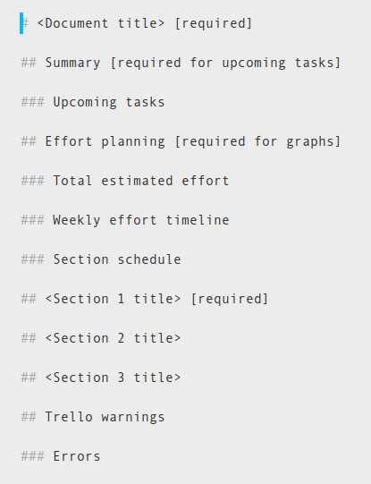
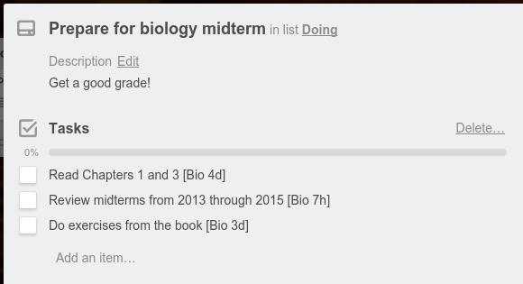

# ProjectPlanner (alpha)

Project Planner is a Sublime Text 3 plugin aiming to simplify planning next-actions for medium-sized projects. A next-action is an action to be undertaken soon, for example, in the following sprint.

The planner is structured into sections (focus groups) which contain tasks. Tasks can be tagged (e.g. `Tom`, `Josh`), given duration and deadlines.

The planner is based on the [Markdown syntax](https://github.com/adam-p/markdown-here/wiki/Markdown-Cheatsheet). Markdown is readable and can be compiled to HTML to produce a report which can be shared with others.

This project is in **alpha** stage. Use this plugin at your own risk. At least ensure to have your project plan file in a version control system to be able to restore it if the plugin corrupts it.

Unlike "big" project planning tools, this tools allows you to focus on preparing just the upcoming tasks and automatically scheduling tasks with and without deadline. This tool is for you if you think Gantt's charts are overkill, but still want to have a holistic view of your project.

The plugin is run on all files ending in `.projectplan.md` when they are saved.

## Use cases

- **Are you a Student?** Plan all your school work, exams as well as side projects and hobbies.
- **Are you the CTO of a startup?** Automatically plan sprints based on tasks from different development departments (Hardware, Software, etc) or people (Josh, Tom, etc). Create a long term roadmap to reach your company's goals.
- **Do you work on several projects?** Plan your work and always be on top of it.

## Sections

A section is a focus area which contains tasks. Section help categorize disparate tasks into groups. Example of sections can be *School work*, *Personal Projects*, *Work projects*. 

A section is delimited like this: `## Section title`.

## Tasks

Sections can have severals tasks. Tasks are units of work of variable granularity.

Tasks must start with a `-` sign. Example: 
```
- Prepare dinner
```

A task can be marked as completed, by changing the `-` with a `+`. Example:

```
+ Prepare dinner
```

After saving the file, the plugin with automatically strike the task and append the completion date.


### Meta information 

Each task can be given a deadline, a duration, and other meta-data. Meta information is important for project planning.

Examples:

- `- Prepare dinner [2h]`: Task duration is 2 hours.
- `- Prepare dinner [2015-12-17]`: Complete task by 17th December
- `- Prepare dinner [2h 2015-12-12]`: Complete the 2 hour long task by 17th December.
- `- Dream of sheeps [M]`: This task is not required (`M` stands for maybe).
- `- Prepare landing page [Design 4h Code 2d]`: This task has a design and a coding aspect, lasting 4 hours and 2 days respectively.
- `- Prepare landing page [Design 4h Code 2d 2015-02-45]`: Save as above, with deadline.
- `- Write blog post [M Josh 4h]`: Categories can also be people. This task is optional.

Valid **time** identifiers are: `m`inute, `h`our, `d`ay, `w`week, and `M`onth

Valid **categories** are: any string of length 2 or more characters.

Valid **flags**: `M`aybe (optional task)

## The awesome stuff

Task meta-data is necessary for planning the execution of the tasks over time. Sometimes the plugin is able to automatically infer a task's duration based on the duration of similar tasks.

**Note**: The first line in the file MUST be a heading, for example: `# My Work Plan`.

### Section summaries

Using on the meta information provided, the plugin can calculate the duration of each section.



In this example, after the file has been saved, the plugin has added two lines:

1. Section duration summary. This contains the number of non-optional tasks in the section (3 tasks), their total duration (1m 1w 4d) and the amount of work per category (Math 2w, None 2w, Art 2w). The plugin has automatically created the section None to contain all uncategorized tasks.
2. Section schedule graph. This graph summarizes when the tasks will be completed. Each character is a week, and the height of the graph indicates the amount of work in that week. To generate this graph the scheduling algorithm takes into account all the tasks in the document - not just in the section.

### Last save date

Under the file title the plugin will automatically add the date when the file was last saved (compiled).


### Upcoming tasks

ProjectPlanner is able to list upcoming tasks (taken from all sections in the file). Upcoming tasks are inserted in a section named `### Upcoming tasks`.



The plugin has selected upcoming tasks based on the deadlines and durations of the tasks. See section *Prioritizing sections* for more advanced scheduling options.

By default, the plugin display 10 upcoming tasks from all categories and up to 5 for each category. It is possible to see more upcoming tasks like this: 



### Effort planning

The plugin generates graphs of the planned effort. All such graphs are generated in a section called `## Effort plannig`. Within this section you can add subsections into which specific graphs are rendered.

These graphs should help you plan work in advance and see how adjusting the meta-data of tasks affects the project execution.

#### Total estimated effort

To display a graph of total effort per category, add the subtitle `### Total estimated effort`. This will generate a graph like this:



#### Weekly effort timeline

To see how the work is distributed between categories over time is is useful to display a weekly effort graph with the keyword `### Weekly effort timeline`. Example:


By default it shows the work distribution for the next 10 weeks. It is possible to see more or less weeks into the future by modifying the title with the number of weeks to show, like this:

`### 5 weekly effort timeline`: Show 5 weeks only

or

`### 20 Weekly effort timeline`: Show 20 weeks

#### Section schedule

The plugin can also display the distribution of work for each section over time within a subsection titled `### Weekly schedule`, like this:


It is possible to toggle between showing all the graphs *to scale* (normalized to their maximum value) by appending `to scale` to the section title.

It is possible to draw the graph for more or less weeks (default is 40 weeks) by prepending the title with the duration in weeks, like `30w` or `60w`.

### Prioritizing sections

By default, the scheduling algorithm with take tasks from each section with equal probability, from top to bottom. If you wish to focus on a section more than others you can tweak the algorithm by adding a weight in the section title. Examples:

`## Language studies (3x)`: Tasks in this section are 3 times more urgent than task in a normal section

`## Side projects (0.5x)`: Tasks in this section have lower urgency than normal.

Adjusting the section priorities can have a big impact to the generated schedule:


## Recommended document layout

The recommended document layout is:



Other document layouts have not been tested, and may not work with the current state of the plugin (alpha).

## Trello integration

This plugin may optionally be used in combination of a Trello Board. Both the Trello board and the product plan document share a similar structure. A list in Trello is equivalent to a section in ProjectPlanner, and a card in Trello is equivalent to a task in Project Planner.

The main benefit of integrating with Trello is the ability to perform more detailed task planning using Trello's checklists, while using the Project Planner to set deadlines, priorities and ordering task.


Synchronization with Trello can accessed from the quick panel (`Ctrl`+`Shift`+`p`)

In order to update tasks in your file with duration information from Trello cards, you must link the tasks to the corresponding cards, like this: 


### Updating metadata

In Trello, create a card, link it to your task as shown previously, and create a checklist with items. Each item can have meta-data defined in a similar manner than tasks. Note that this plugin will only synchronize task duration and not deadlines. Deadlines should be configured in your Project Planner file.



In your Project Planner file add the task and link it to the Trello card like this:

```
- [Prepare for biology midterm](https://trello.com/c/oaf76ars/23-prepare-for-biology-midterm)
```

Run the synchronization, and the plug-in will automatically add the following meta data to your file:

```
- [Prepare for biology midterm](https://trello.com/c/oaf76ars/23-prepare-for-biology-midterm) [Bio 1w]
```
Save the file, and the schedule (upcoming tasks, graphs, etc) will be updated.

### Error detection and last update timestamp

When synhronizing with Trello, the plugin is able to notify you of the following:

- Missing lists: Do you have lists in Trello, but not in teh file? The plugin will ask you to add the corresponding section.
- Missing cards: Do you have cards in Trello, but not in the file? The plugin will ask you to add the task to the file. 
- Different list orders: Is the order of the sections in your file different than the order of the lists on the Trello board? The plugin will ask you to reorder the sections.

In order to see the above warning warnings include a section `## Trello warnings` with a subsection `### Errors` in you document. After synchronizing, you should see something like this:

```
## Trello warnings

Last synced: 2015-11-28 15:45

### Errors

There are no errors

```

## Preferences

The following preference options are available:

|Option| Description | Example|
|------|------------|---------|
|`default_daily_category_workload`| Duration of an average work day in hours | 8|
|`TRELLO_API_KEY`| The API key for Trello | `...` |
|`TRELLO_API_SECRET`| The API secret for Trello | `...` |
|`TRELLO_TOKEN`| Trello token | `...` |
|`TRELLO_TEST_BOARD_ID`| The id of the board to synchronize with you project plan | `345hnnwn` |
|`SKIP_LISTS`| Lists from your Trello boards which you do not want to synchronize | `["Wishlist", "DONE"]` |
|`SKIP_CHECKLISTS`| The titles of checklists which the plugin should ignore | `["TODO"]` |
|`DONE_LISTS`| Cards in these lists will cause your corresponding tasks to be marked as completed | `["DONE"]` |

## Contributing

Feel free to submit PRs. I will do my best to review and merge them if I consider them essential.

## Development status

This is alpha software. The code was written with no consideration of coding standards and architecture. A refactoring would do it good...
